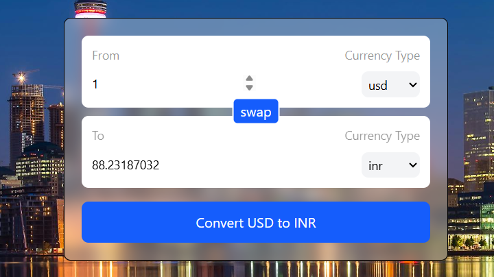

# Currency Converter 💱

A simple and responsive Currency Converter application built with **React + Vite**.  
It allows users to convert between multiple currencies in real-time with a clean UI.

---

## 🖥️ About the Project

The **Currency Converter** is a modern, responsive web application built with **React** and **Vite**. It allows users to quickly convert amounts between multiple currencies using real-time exchange rates.

### Technologies Used

- **React** – For building reusable and interactive UI components.
- **Vite** – For a fast development experience and optimized build.
- **Tailwind CSS** – For utility-first, responsive styling.
- **Custom Hook (`useCurrencyInfo`)** – To fetch and manage live currency data efficiently.

### Optimizations

- **Component Reusability:** The `InputBox` component is reusable for both "From" and "To" inputs, reducing code duplication.
- **State Management:** Controlled components with React `useState` keep the UI in sync with user input without unnecessary re-renders.
- **Lazy and Efficient Rendering:** Only the components that need to update re-render when the state changes, improving performance.
- **Responsive Design:** Tailwind CSS ensures the website adapts to different screen sizes.
- **Minimal Dependencies:** Using only necessary libraries ensures a lightweight and fast-loading app.

---

## 🚀 Features

- Convert from one currency to another
- Select from multiple currency options
- Input amount dynamically and get results instantly
- Clean and reusable component design (`InputBox`)
- Responsive and minimal UI

---

## 🛠️ Tech Stack

- **React** (with Hooks like `useState`, `useEffect`, `useId`)
- **Vite** (for fast build and development)
- **JavaScript (ES6+)**
- **Tailwind CSS** (for styling)

---

## 📂 Project Structure

```
currency-converter/
│── src/
│   ├── components/
│   │   └── InputBox.jsx   # Reusable input + currency select component
│   ├── App.jsx            # Main application logic
│   ├── main.jsx           # Entry point
│   └── index.css          # Global styles
│── public/
│── package.json
│── vite.config.js
└── README.md
```

---

## ⚙️ Installation & Setup

1. Clone the repository:

   ```bash
   git clone https://github.com/your-username/currency-converter.git
   ```

2. Navigate into the project folder:

   ```bash
   cd currency-converter
   ```

3. Install dependencies:

   ```bash
   npm install
   ```

4. Start the development server:
   ```bash
   npm run dev
   ```

---

## 📸 Screenshots




---

## 📦 Future Improvements

- Add **live API** integration for real-time exchange rates
- Show **conversion history**
- Support for **dark mode**
- Add **unit tests**

---

## 🙌 Contributing

Contributions are welcome!

- Fork the repo
- Create a new branch
- Make your changes
- Submit a PR 🚀

---
